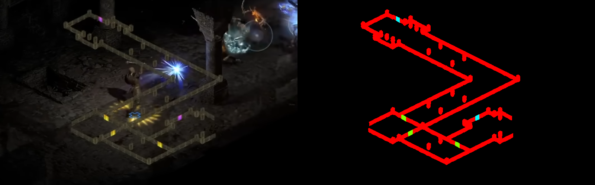

# Overlay Segmenter

This uses an [U-Net](https://en.wikipedia.org/wiki/U-Net) CNN to segment an overlay, the specific situation it was
intended for is an isometric game where the level map is overlaid on top of the game area.

Training of the network, including data generation and augmentation is done in Python. 
For inference there's a Rust implementation using my [flash_powder](https://github.com/iwanders/flash_powder) Rust - LibTorch bindings.



The output of the model shown here outputs five classess to represent the various map elements and the background.
The model does well because it's trained on randomly created data that's postprocessed to be compressed, resized and blurred images.
It is also able to see through the [text](./doc/example_screenshot_text_1776131289.png) backdrop pretty well.


## Inference using Rust
The [overlay_segmenter](./overlay_segmenter) Rust crate holds the code to run inference, this does still require LibTorch which it finds through the sourced venv.
This Rust crate was the main reason for me to develop my [flash_powder](https://github.com/iwanders/flash_powder) bindings.

Alternatively the `./inference.py inference` subcommand can be used to run inference on image files.

## Training

Training data is generated during training to ensure a broad distribution of training data that is not limited to a pre-
generated set of images.
To do this, the dataset generator requires a collection of background images and overlay (foreground) images.
The overlay images also require a label counterpart, or alternatively the alpha channel can be used with a threshold.

To generate a training (or validation) image the process is as follows:
A background image is randomly selected and in it, randomly using a gaussian distribution around the center a tile is cut out.
Same for the overlay, it is randomly selected and a random (uncorrelated) position is chosen, these are then combined.
The desired output values are created from the overlay image's segmentation labels.
Additionally, disturbance images may be added, or text in a semi-transparent rectangle.
Finally, there are several post-processing steps that happen on the rgb image, like a downscale-upscale roundtrip, jpeg compression, gaussian blurs or a combination of any of these.

The actual pipeline can be configured in various ways and with multiple steps.
The paragraph above describes the [dataset_example.yaml](./train/dataset_example.yaml), which is merely an example file.

My actual training file is more involved, with a much longer list of image groups, and more disturbances, but the same process & steps.

## Cheatsheet of commands
Training:
```
./train.py -c ./dataset_example.yaml
```

Resume training from a checkpoint with:
```
./train.py  -c ./dataset_example.yaml -l /tmp/train/latest/model.pth
```

Inference using a checkpoint, writes files adjacent to the images for inspection.
```
./inference.py inference -c <checkpoint> <images>
```

Convert checkpoint to safetensors for usage from Rust, by default with fp16:
```
./inference.py convert -c <checkpoint> --output /tmp/unet.safetensors
```
